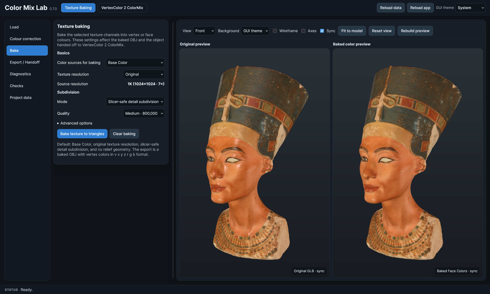
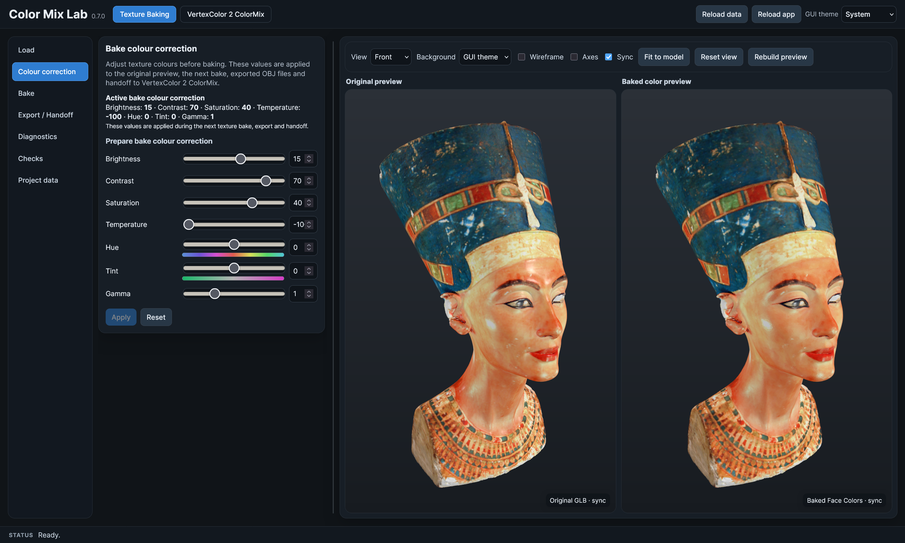
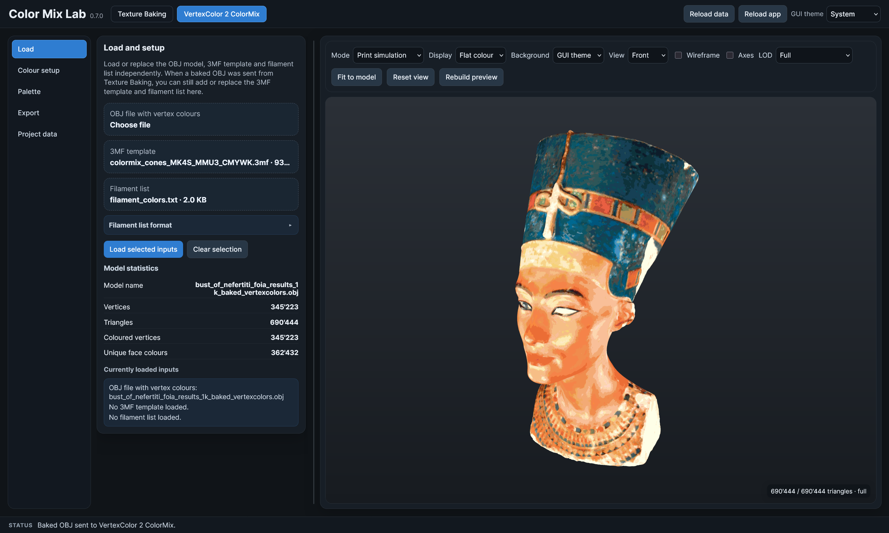
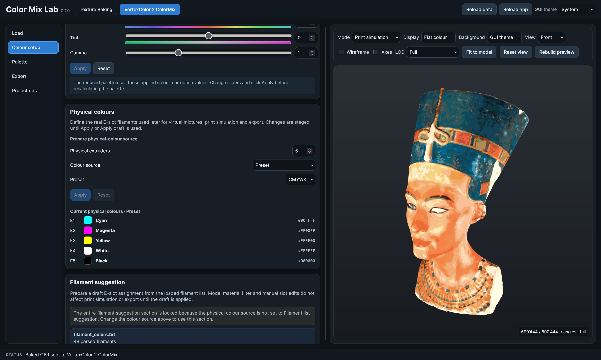
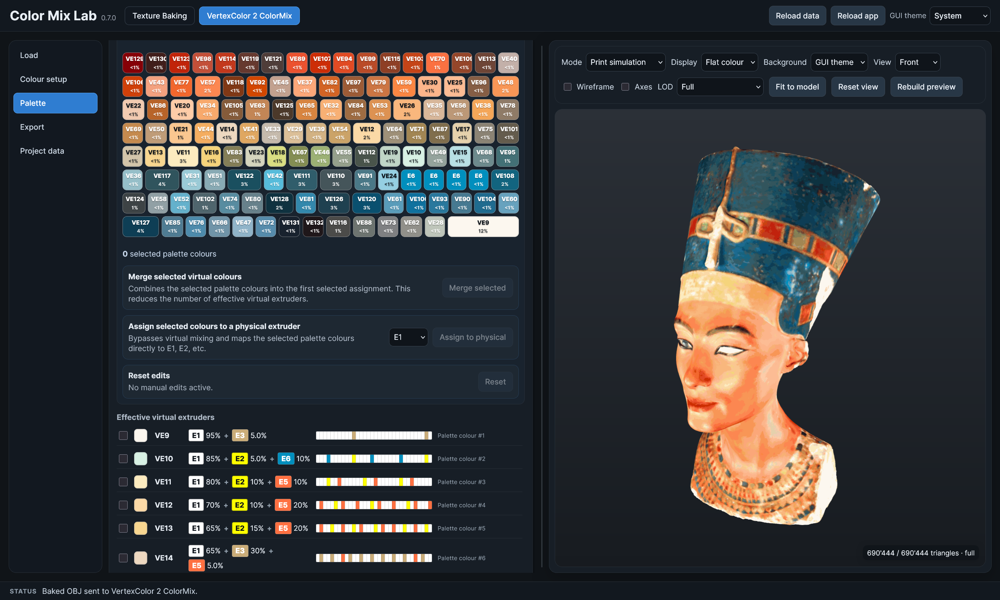
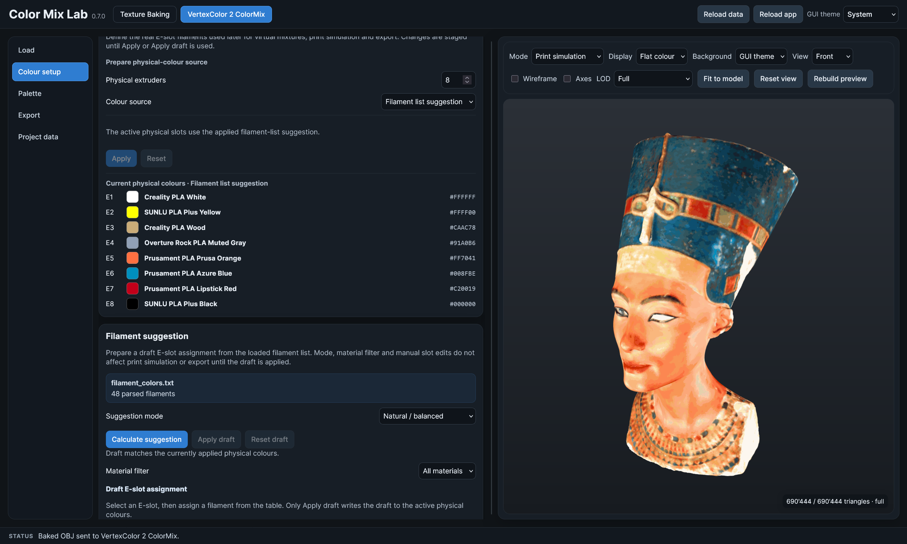
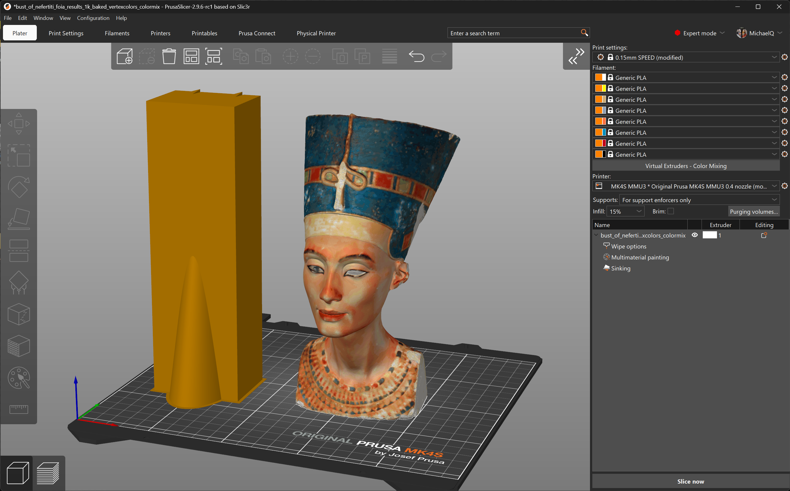
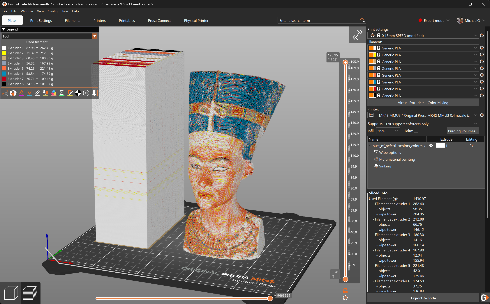

# Color Mix Lab

**Color Mix Lab** is a browser-based tool for converting textured or vertex-coloured 3D models into PrusaSlicer-compatible 3MF projects using virtual colour and extruder mixes.

It is an experimental lab and reference workflow for preparing colour-rich 3D models for PrusaSlicer ColorMix / virtual extruder workflows.

> **Status:** Experimental lab project. Not a supported production tool.

<!-- Screenshot suggestion:
Main application overview showing the Color Mix Lab interface.
-->


---

## What is Color Mix Lab?

Many 3D models contain colour information as textures, materials, or vertex colours. At the time this tool was created, PrusaSlicer did not directly convert arbitrary textured models into virtual colour mixes for the ColorMix workflow. This may change in future PrusaSlicer releases. Color Mix Lab provides an experimental workflow for converting these model colours into a PrusaSlicer-compatible 3MF project.

The app has two main parts:

- **Texture Baking** converts texture or material colours into baked model colours.
- **VertexColor 2 ColorMix** converts baked or vertex-coloured models into reduced palettes, physical colour assignments, virtual blends, print simulations, and PrusaSlicer 3MF exports.

The intended workflow is:

**Textured model → baked colours → reduced target palette → physical colours → virtual blends → PrusaSlicer 3MF**

Selected capabilities:

- combine Texture Baking and VertexColor 2 ColorMix in one browser-based app,
- configure up to eight physical extruders,
- import filament colour lists and generate model-based filament colour proposals,
- generate a reduced target palette that is independent of the number of physical extruders,
- generate effective virtual blends for PrusaSlicer ColorMix / virtual extruder workflows,
- preview the reachable colour approximation using an FDM-oriented mixer model,
- use 3MF templates to preserve printer and filament-slot configuration,
- process models locally in the browser without a server-side workflow.

Color Mix Lab is not a general full-colour slicer. It is a focused lab tool for this specific texture/vertex-colour to PrusaSlicer ColorMix workflow.

---

## Main workflows

Color Mix Lab contains two related but separate workflows.

### Texture Baking

The **Texture Baking** workflow is used for models that contain texture or material colours but do not yet contain directly usable baked colour information.

Texture Baking converts visible texture or material colours into baked model colours. These baked colours can then be used in the VertexColor 2 ColorMix workflow.

This workflow is useful when a model looks coloured in a 3D viewer, but the colour information is stored in textures rather than in geometry-level colour data.

For supported file types, see [Supported inputs](#supported-inputs).




### VertexColor 2 ColorMix

The **VertexColor 2 ColorMix** workflow is used for models that already contain baked or vertex-level colour information.

VertexColor 2 ColorMix reduces the model colours, maps them to physical and virtual extruder colours, previews the reachable colour approximation, and exports a 3MF project intended for PrusaSlicer.

This workflow can be used independently of Texture Baking. For example, a model baked in Blender can be loaded directly into VertexColor 2 ColorMix.

For supported file types, see [Supported inputs](#supported-inputs).



---

## Typical workflow

A typical full workflow starts with a textured model and ends with a PrusaSlicer-compatible 3MF project.

1. **Load textured model**  
   Load a GLB or OBJ/MTL model with textures into the Texture Baking workflow.

2. **Apply bake colour correction**  
   Adjust colour correction settings if the texture colours need to be corrected before baking.

3. **Bake colours**  
   Convert the visible texture or material colours into baked model colours.

4. **Send to VertexColor 2 ColorMix**  
   Transfer the baked model to the VertexColor 2 ColorMix workflow.

5. **Configure physical colours**  
   Select the number of physical extruders and assign real filament colours manually or from a filament list.

6. **Generate palette and virtual mixes**  
   Generate the reduced target palette and the effective virtual colour blends.

7. **Export PrusaSlicer 3MF**  
   Export a 3MF project for PrusaSlicer, optionally based on a 3MF template.

8. **Inspect in PrusaSlicer**  
   Open the exported 3MF in PrusaSlicer and check all printer, filament, extruder, wipe, and preview settings before printing.



---

## Supported inputs

| Type | Supported | Workflow / purpose |
| --- | --- | --- |
| GLB | Yes | Texture Baking |
| OBJ + MTL + textures | Yes | Texture Baking |
| OBJ with vertex colours | Yes | VertexColor 2 ColorMix |
| Baked OBJ model | Yes | VertexColor 2 ColorMix |
| 3MF template | Yes | Recommended for PrusaSlicer export |
| Filament CSV | Yes | Physical colour proposal and colour reference |
| STL | No | STL does not contain colour information |
| Generic 3MF model import | No | 3MF is used as a template/export format, not as a general colour-model import workflow |

The practical result depends strongly on the structure and quality of the input model. Clean geometry, valid UV maps, correctly assigned textures, and consistent colour data improve the result.

---

## Supported outputs

| Output | Supported | Notes |
| --- | --- | --- |
| PrusaSlicer-compatible 3MF project | Yes | Main export target |
| Baked model data for internal handoff | Yes | Used between Texture Baking and VertexColor 2 ColorMix |
| General full-colour slicer project | No | Color Mix Lab is not a full-colour slicer |
| Universal slicer-compatible 3MF | No | The 3MF export is intended for PrusaSlicer |

For export details and the recommended PrusaSlicer inspection checklist, see [PrusaSlicer / 3MF export](#prusaslicer--3mf-export).

---

## Key concepts

### Reduced target palette

The **reduced target palette** describes the important colours of the model after colour reduction.

It is the target colour set that the model should preserve as well as possible. It is not limited to the number of physical extruders.

For example, a model may have a reduced target palette of 64 or 128 colours, while the printer may only have five or eight physical filament colours. The target palette describes the model. The physical colours describe the printer setup.

The reduced target palette should:

- preserve dominant colours,
- preserve visually important accent colours,
- merge very similar colours where reasonable,
- provide useful colour targets for virtual blend generation.

### Physical colours

**Physical colours** are the real filament colours available in the printer.

They correspond to the actual loaded filaments or extruder slots, for example cyan, magenta, yellow, white, black, grey, brown, red, or any manually selected filament colour.

Physical colours define the available colour basis from which virtual blends can be generated.

### Virtual extruders

**Virtual extruders** are PrusaSlicer-side colour entries that represent a mix of physical extruders.

Instead of using only the real filament slots, PrusaSlicer can represent additional virtual colour entries by combining physical extruders according to defined mixing ratios.

Color Mix Lab uses this concept to approximate more model colours than would be possible with the physical filaments alone.

### Effective virtual blends

**Effective virtual blends** are the actual reachable colour mixes generated from the selected physical colours.

They represent the colours that Color Mix Lab can approximate with the configured physical filament set and the supported virtual mixing logic.

The effective virtual blends are therefore different from the reduced target palette:

- The **reduced target palette** describes the desired model colours.
- The **effective virtual blends** describe the colours that are reachable with the selected physical filaments and virtual mixing constraints.



### Print simulation

The **print simulation** previews how the model may look after mapping the reduced target palette to the available physical colours and effective virtual blends.

The print simulation is a diagnostic approximation, not a guarantee of the real printed result.

It is meant to be closer to the PrusaSlicer / ColorMix concept than a simple RGB average. For practical print-related caveats, see [Limitations](#limitations).

### Prusa FDM Mixer preview model

Color Mix Lab’s preview logic is based on the idea of Prusa’s `prusa-fdm-mixer` model rather than a simple RGB or sRGB layer average.

This matters because FDM colour mixing is not just a mathematical RGB blend. Real filament mixing is affected by material behaviour, layer interaction, pigment strength, and the way the slicer represents virtual mixes.

The preview should therefore be understood as a slicer-oriented approximation, not as an exact optical simulation.

---

## Filament lists

Color Mix Lab can import filament colour lists, for example from CSV exports.

The app is not intended to be a filament database. It does not try to manage spools, stock, purchase data, or detailed filament profiles.

Instead, filament lists are used as external colour reference data.

A filament list can be used to:

- select real filament colours,
- propose physical colour sets,
- compare available filaments against model colours,
- provide colour values for virtual blend generation.

Possible external sources include:

- Filament-DB,
- OpenPrintTagDB-based colour data,
- manually maintained CSV files.

Color Mix Lab uses filament colours only as input for colour selection, proposal, and mixing calculations. The slicer’s actual filament profiles remain part of PrusaSlicer and, where applicable, the selected 3MF template.



---

## PrusaSlicer / 3MF export

Color Mix Lab exports 3MF projects intended for PrusaSlicer.

The ColorMix / virtual extruder workflow targeted by Color Mix Lab is based on PrusaSlicer 2.9.6 development releases. Earlier PrusaSlicer releases, including 2.9.5, do not provide the same ColorMix workflow.

The export can use an existing 3MF template to preserve printer-specific settings. This is recommended because printer, filament, and extruder settings are usually more reliable when they come from a known working PrusaSlicer project.

A 3MF template can help preserve:

- printer profile settings,
- physical extruder count,
- filament slot definitions,
- filament profile references,
- wipe and purge settings,
- PrusaSlicer metadata,
- printer-specific configuration.

Color Mix Lab focuses on adding or updating the colour-mix-related parts required for the generated model and virtual extruder workflow.

After export, the 3MF should be checked in PrusaSlicer.

Recommended checks:

- physical extruder count,
- virtual extruder entries,
- physical filament colours,
- virtual colour blends,
- filament profile assignments,
- purge and wipe configuration,
- model placement,
- slicer preview,
- estimated filament changes,
- estimated print time,
- estimated waste.

Compatibility with other slicers is not a goal.




---

## Limitations

Color Mix Lab is experimental and has several important limitations.

### Browser-based processing

All processing happens in the browser on the user's own computer. No server-side processing is required for the core workflow.

The app was developed and tested primarily in Firefox. Firefox was the main browser used during development and iterative testing.

Chrome, Edge, and Safari were not tested as extensively. They may work, but behaviour, memory use, WebGL performance, file handling, and rendering stability can differ between browsers and operating systems.

Performance depends on both the local system and the complexity of the processed model.

Relevant local system factors include:

- CPU performance,
- GPU performance,
- available RAM,
- graphics driver,
- browser engine.

Relevant model and workload factors include:

- model size,
- triangle count,
- texture resolution,
- number of colours,
- number of virtual blends.

A fast CPU, a capable GPU, and sufficient RAM are strongly recommended when working with large or complex models.

Models with a very high triangle count can slow down the browser significantly or exceed available memory. This is especially relevant for dense scanned models, heavily subdivided meshes, or textured models that are baked into very detailed geometry.

### FDM colour mixing and print simulation are approximate

FDM colour mixing is not exact colour reproduction. The print simulation helps evaluate whether the chosen physical colours and virtual blends are plausible, but it does not guarantee the final print appearance.

The same virtual mix can look different depending on several groups of factors:

- **Filament and material properties:** brand, material type, pigment strength, translucency, and colour consistency.
- **Slicer and process settings:** layer height, nozzle diameter, extrusion width, temperature, speed, cooling, purge volume, and wipe strategy.
- **Printer and calibration:** extrusion calibration, tool or filament change behaviour, mechanical accuracy, and general printer tuning.
- **Model and viewing conditions:** model geometry, surface orientation, lighting, and camera or viewer settings.

### PrusaSlicer-focused export

The generated 3MF is intended for PrusaSlicer and its virtual extruder / ColorMix workflow. It is not intended as a universal slicer format. For export behaviour and recommended checks, see [PrusaSlicer / 3MF export](#prusaslicer--3mf-export).

### Input model quality matters

Poorly structured models can lead to poor results.

Common issues include:

- missing textures,
- broken MTL references,
- bad UV maps,
- non-manifold geometry,
- extremely dense meshes,
- inconsistent vertex colours,
- transparent or complex materials that do not bake cleanly.

### Not a maintained product

Color Mix Lab is provided as a lab and reference implementation. As stated at the top of this README, it is not intended to be maintained as a supported product. Issues may not be answered.

---

## Installation / local development

Color Mix Lab is a Node.js / Vite-based browser application.

Install dependencies:

```bash
npm ci
```

Start the local development server:

```bash
npm run dev
```

Build the app:

```bash
npm run build
```

The production build is generated in the `dist/` directory.

For source packages, `dist/` and `node_modules/` do not need to be included.

---

## GitHub Pages deployment

Color Mix Lab can be deployed as a static web application, for example with GitHub Pages.

A typical deployment flow is:

```bash
npm ci
npm run build
```

Then deploy the generated `dist/` directory using the GitHub Pages setup of the repository.

The exact deployment configuration depends on the repository structure and Vite base path configuration.

---

## Development background

Color Mix Lab started as an experimental attempt to make richly coloured 3D models usable for multi-material FDM printing.

The original motivation goes back to 2022, when I saw the coloured Bust of Nefertiti on the Prusa3D website as part of the promotion for the MMU2S with the MK3S. That image was one of the reasons why I wanted a Prusa printer in the first place: I wanted to print models like that in multiple colours. At that time, however, my printer setup was not yet ready for this workflow. I later purchased an MMU2S together with a Prusa MK3S+, but never installed it. Only after setting up an MMU3 on a Prusa MK4S did the idea become practical enough to revisit.

Another trigger was a visit to a Yayoi Kusama exhibition. I wanted to print a polka-dot pumpkin and found suitable textured models on Sketchfab. The key question was how to bring such a textured model into PrusaSlicer while preserving its colours.

I then found workflows describing texture baking in Blender and importing textured OBJ/MTL models into Bambu Studio. These workflows worked in principle, but using them with only five physical colours was tedious and not very practical. The idea was put aside again for a while.

With the introduction of ColorMix / FDM Mixer concepts in PrusaSlicer, the topic became interesting again. I experimented with the Nefertiti model, Blender, the current Bambu Studio, and also looked at the OrcaSlicer-FullSpectrum fork. The colours could be displayed there, but not as virtual extruders in the same way as PrusaSlicer handles them.

The first working prototype was a Python script with a graphical user interface. It already produced convincing results and gradually grew to include additional features, such as loading filament lists with colour data, using CSV exports from Filament-DB, importing colours based on OpenPrintTag data, and using 3MF templates for specific printer configurations.

After dozens of Python-script iterations, roughly 40 by my own count, the tool was rebuilt as a browser-based Node.js application, inspired by small web-based colour tools such as Color Mix Shading. The two main workflows were initially developed as separate apps: one for texture baking and one for converting already baked or vertex-coloured models into PrusaSlicer-compatible 3MF projects. They were later merged into a single application so that both workflows can be used independently or combined.

The subsequent browser-based app also went through more than 180 iterations: developed, tested, adjusted, and tested again, mainly in Firefox. The development process was heavily AI-assisted and highly iterative. One practical limitation was the maximum ChatGPT conversation length. Several times, the work had to continue in a new chat, which meant that project context had to be reconstructed and already clarified details had to be explained again. This added friction to the development process and occasionally made the iteration cycle more cumbersome than expected.

The result is not a polished production tool, but a lab environment for experimenting with colour reduction, virtual extruder generation, filament-based colour matching, texture baking, and PrusaSlicer 3MF export.

The results that can be achieved with Color Mix Lab are promising. However, practical printing with MMU3 is still limited by filament waste and long tool-change times. The workflow will likely become more attractive with systems such as INDX and eight physical extruders. Unfortunately, I could not order an INDX in April; I was too slow. A small Nefertiti test print was already produced using an earlier Python-script version of the workflow.

Color Mix Lab is shared in the hope that others may find the approach useful and continue developing it.

---

## Acknowledgements

Color Mix Lab builds on ideas, tools, and workflows from the broader 3D printing and open-source ecosystem.

Acknowledgements include:

- PrusaSlicer and Prusa Research for the ColorMix / virtual extruder workflow.
- The `prusa-fdm-mixer` work as a basis for a more realistic FDM-oriented preview model.
- Blender and its texture baking workflows.
- Three.js and related browser-based 3D technologies.
- Filament-DB as a useful source for externally maintained filament lists.
- OpenPrintTagDB as a source of filament colour reference data.
- Existing community discussions and examples around OBJ/MTL texture workflows.
- OrcaSlicer-FullSpectrum as a related slicer fork exploring mixed-colour filament workflows.
- Browser-based colour tools such as Color Mix Shading.

Reference links:

- Bambu Lab OBJ/MTL workflow discussion: https://forum.bambulab.com/t/how-do-you-do-the-new-obj-with-mtl-feature/75622/12
- Blender: https://www.blender.org/
- Bust of Nefertiti model: https://sketchfab.com/3d-models/bust-of-nefertiti-foia-results-8c60faca6152405e9d35784efa8b9aa1
- Color Mix Shading: https://gzeus.github.io/Color-Mix-Shading/
- Filament-DB: https://github.com/hyiger/filament-db/releases
- Kusama-style pumpkin model search: https://sketchfab.com/search?q=Kusama+pumpkin&type=models
- OpenPrintTagDB: https://github.com/OpenPrintTag/OpenPrintTagDB
- OrcaSlicer-FullSpectrum: https://github.com/ratdoux/OrcaSlicer-FullSpectrum
- Prusa FDM Mixer: https://prusa3d.github.io/prusa-fdm-mixer/
- PrusaSlicer 2.9.6 releases on GitHub: https://github.com/prusa3d/PrusaSlicer/releases
- Texture baking workflow video: https://www.youtube.com/watch?v=8_snhrVIcy4
- Three.js: https://threejs.org/

---

## License

This project is licensed under the MIT License.

See the `LICENSE` file for details.
